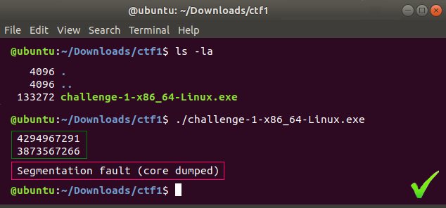

### [2021 Grand Reverse Engineering Challenge](https://grand-re-challenge.org/challenges.html)
___

Round 1 and Round 2 of the **2021 Grand Reverse Engineering Challenge** has **10 challenges**, described below.
Some are compiled for **Linux/x86/64**, some are compiled for **Linux/ARM/32**.
The ARM binaries run well on a Raspberry Pi 4 [they have been tested on RPI4 running 32 bit Raspbian].
There are three types of challenges: **deobfuscation**, **tampering**, and **extraction**.

Note that the challenges do not necessarily represent the best protections available from the obfuscation tools we have at our disposal - rather, they were designed to be possible to crack.
Our end goal with this competition is to collect information for the community on how attacks are carried out in the real world.
In other words, this is not a competition between providers of obfuscation tools, but a competition between attackers!
We do not provide information on which tool was used to protect which challenge, and which protective transformations were employed - figuring this out is part of the challenge.

For each challenge we use the scale **LIGHT**, **MEDIUM**, **HEAVY** to give a rough indication of the amount of protection [i.e. obfuscation and tamperproofing] that has been added.

#### **[Round 1](https://grand-re-challenge.org/grand-re-challenge-round-1.zip)**

- [X] [Challenge 1](2021_Grand_Reverse_Engineering_Challenge/Challenge_1) [EN](Challenge_1/sol_en.pdf) [RU](Challenge_1/sol_ru.pdf) **LIGHT EXTRACT X86 ARM**
*Challenge-1-x86_64-Linux.exe* and *Challenge-1-armv7-Linux.exe* read two unsigned 32-bit numbers in decimal form from standard input and print a number to standard output.
A successful submission consists of two 32-bit numbers that, when read from standard input, cause the program to crash with a segmentation fault.
The original program is about 600 lines of C, the obfuscated program about 21,000 lines.


- [ ] Challenge 2 **MEDIUM DEOBFUSCATE X86**
*Challenge-2-x86_64-Linux.exe* read two unsigned 32-bit numbers in decimal form from the command line and print a number to standard output.
The goal is to deobfuscate the program and return it to idiomatic C.
The original function is small, less than 100 lines of C.

- [ ] Challenge 3 **HEAVY DEOBFUSCATE X86**
*Challenge-3-x86_64-Linux.exe* takes 3 command line arguments, 32-bit unsigned integers in decimal form.
```bash
# For example:
./Challenge_3_linux_x86_64.exe 35329 234792379 1100292587
# will produce an output of the form:
# Answer for x = 35329, y = 234792379, z = 1100292587 is 3546740429
```
The code defines a piecewise mathematical function on the inputs.
Your job is to figure out what that function is.
The answer is not elegant, but it is short: each part of the function can be written in one line.

- [ ] Challenge 4 **HEAVY DEOBFUSCATE X86**
*Challenge-4-x86_64-Linux.exe* is identical to Challenge 3, but uses a different type of protection.

- [ ] Challenge 5 **LIGHT EXTRACT ARM**
*Challenge-5-armv7-Linux.exe* takes a license key as its first argument on the command line.
It is your job to find this key.

- [ ] Challenge 6 **MEDIUM EXTRACT ARM**
*Challenge-6-armv7-Linux.exe* is a protected version of the zip utility.
```bash
# A list of command-line arguments can be generated with:
./Challenge-6-armv7-Linux.exe --help
# An additional, undocumented command-line argument: **[-K "some string"]** can be used to pass a key to the program.
```
The program only produces valid zip-files when this key is correct. It is your job to find the correct key.

- [ ] Challenge 7 **LIGHT TAMPER ARM X86**
*Challenge-7-x86_64-Linux.exe* and *Challenge-7-armv7-Linux.exe* read two English words from standard input and print a number to standard output.
The words are no longer than 12 characters, consist of the lower case letters a-z, and have been taken from this list.
For two particular words the program will crash with a segmentation fault.
Your task is to modify the program to remove the code that causes this crash [it will now print a number to standard output] while maintaning the same behavior as the original program for all other inputs.

#### **[Round 2](https://grand-re-challenge.org/grand-re-challenge-round-2.zip)**

- [ ] Challenge 8 **VERY LIGHT EXTRACT ARM**
*Challenge_8* takes a license key as its first argument on the command line.
It is your job to find this key. The program prints an error message if the key is wrong.

- [ ] Challenge 9 **MEDIUM EXTRACT ARM**
*Challenge_9* is a protected version of the bsdtar program provided by libarchive.
```bash
# A list of command-line arguments can be generated with:
./bsdtar --help.
# An additional, undocumented argument **[-K "some string"]** can be used to pass a license key to the program.
# Valid tarballs are produced only when this key is correct.
# Multiple license keys are possible.
# To generate a tarball use this command:
./bsdtar --create --gzip -f tarball.tar.gz -K $KEY $INPUT_DIR
# To list the files in the tarball use this command:
./bsdtar --list -f tarball.tar.gz -K $KEY
# This command will fail if the tarball is corrupted.
```
It is your job to write a key generator with which correct license keys can be generated.

- [ ] Challenge 10 **LIGHT TAMPER X86**
*Challenge_10* You are given a binary whose first argument is a password and whose second argument ia the input to a hash function.
The outoput is a hash of the second.
Your task is to remove the password check from the binary.
The cracked binary should take 1 argument and function identically to the original binary if the correct password was entered.
Submit the cracked binary.
